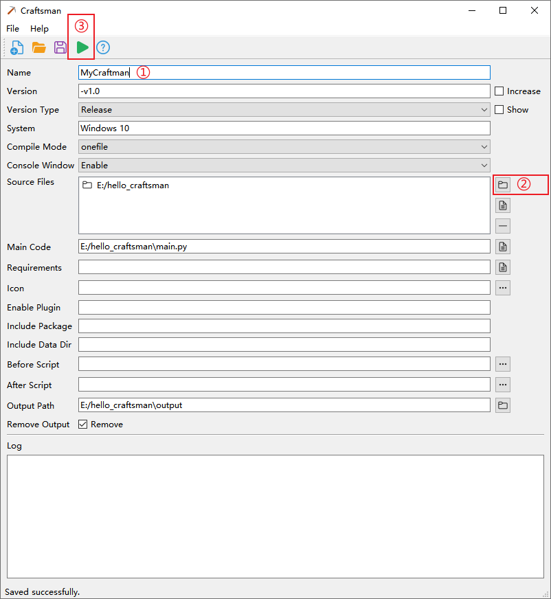
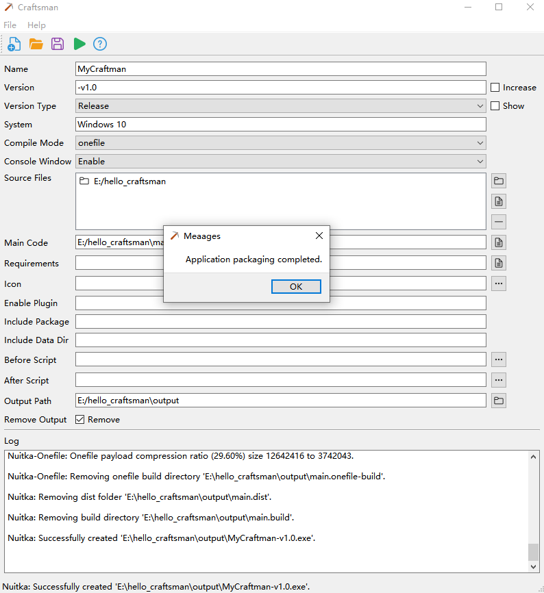

<p align="center">
  <a href="https://github.com/dblabai/craftsman">
  </a>
</p>

<p align="center"><strong>Craftsman</strong> <em>- Python multi-platform visual packaging tool.</em></p>

<p align="center">
  [<a href="README.md">English</a>] | [<a href="docs/README_ZH.md">中文</a>]
</p>


## Quick start

Craftman is a visual Python packaging tool that can package Python source code into binary executable files, supporting Windows, macOS, and Linux.


## Requirements

Before using Craftman, the following software must be installed on the homepage:

- Python 3.7+
- GCC 13+
- Using a virtual environment is recommended to avoid direct system usage (**Craftman** defaults to utilizing a virtual environment).


## Installation

#### Run using source code (no installation required)

1. Download [source code](https://github.com/dblabai/craftsman)

2. Create and activate the environment on the terminal (strongly recommended)

   - Create environment (Your Python executable might be called `python3`):

     ```bash
     python -m venv env
     ```

   - Activate the environment (Linux and macOS):

     ```bash
     source env/bin/activate
     ```

   - Activate the environment (Windows):

     ```bash
     env\Scripts\activate.bat
     ```

3. Install requirements

   ```bash
   pip install -r requirements.txt
   ```

4. Run Craftman

   ```bash
   python main.py
   ```


## Start using

1.  Enter the project name
1. Select a Python project
1. Click to **compile**
1. View the compiled files in the output path

### Parameter

| parameter         | describe                                                     |
| ----------------- | ------------------------------------------------------------ |
| Name              | Application Name                                             |
| Version           | Application version number                                   |
| Version increase  | After opening the project configuration file, a minor version is automatically added. For example, the configuration file is v1.0.0, and it becomes v1.0.1 after opening the configuration file. |
| Version Type      | Mark the type of the current version, default Release        |
| Show Version Type | The packaged application name after selection has a version type, which is not displayed by default. |
| System            | The currently running system environment and the systems supported after packaging |
| Compile Mode      | **standalone** Enable standalone mode for output. This allows you to transfer the created binary to other machines without                it using an existing Python installation. This also means it will become big. <br /><br />**onefile** Thismeans not a folder, but a compressed executable is created and used. |
| Console Window    | When compiling for Windows or macOS, disable the console window and create a GUI application. Defaults enable. |
| Source Files      | Project source code that needs to be compiled into a stand-alone executable file |
| Main Code         | The project startup entry code is automatically recognized after selecting the project source code. Files whose file names include main or app are recognized by default. |
| Requirements      | Manage the version information of dependent packages in Python projects and automatically identify them after selecting the project source code |
| Icon              | Application icon, supports png and ico formats               |
| Enable Plugin     | Plug-ins used in the project, multiple plug-ins are separated by spaces |
| Include Package   | Include a whole package. Give as a Python namespace,  e.g. "some_package.sub_package" and Nuitka will then find it and include it and all the modules found below  that disk location in the binary or extension module it creates, and make it available for import by the code.<br />Use spaces to separate multiple packages |
| Include Data Dir  | Include data files from complete directory in the distribution. This is recursive. |
| Before Script     | Python script executed before compilation                    |
| After Script      | Python script executed after compilation is complete         |
| Output Path       | The output path after application compilation is completed, the output folder under the default project source code |
| Remove Output     | Whether to delete the output content and only keep the executable application files. Delete by default. |


## Open a created project

Craftman uses toml files as project configuration, with the suffix `.cmtf`, usually saved under the **output path**, and the naming rule is: `application name.cmtf`


## Example

### hello_craftsman

This is the simplest example of how to use Craftsman to package an application.

**main.py**

```python
def main():
    print("Hello Craftman")
    _ = input("Press any key to exit \n按任意键退出\n")


if __name__ == "__main__":
    main()
```


1. Fill in the application name: MyCraftman
2. Select the directory where `main.py` is located
3. Click compile




