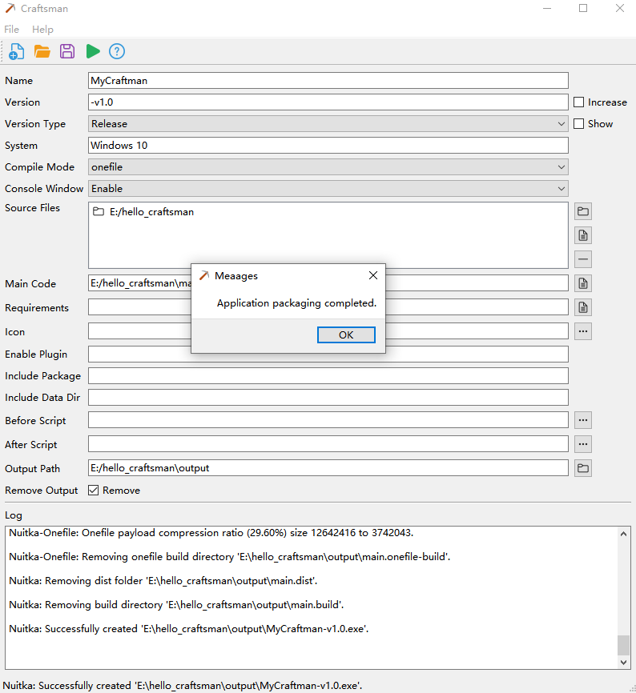

<p align="center">
  <a href="https://github.com/dblabai/craftsman">
  </a>
</p>

<p align="center"><strong>Craftsman</strong> <em>- Python 可视化一键打包可执行文件.</em></p>

<p align="center">
  [<a href="../README.md">English</a>] | [<a href="README_ZH.md">中文</a>]
</p>


## 快速开始

Craftman是一个可视化Python打包工具，可以将Python源码打包为二进制可执行文件，支持Windows、macOS、Linux


## 要求

在使用Craftman之前，首页必须安装以下软件：

- Python 3.7+
- GCC 13+
- 建议使用虚拟环境，避免在系统中直接使用（Craftman默认使用虚拟环境）


## 安装

#### 使用源码运行（免安装）

1. 下载 [源码](https://github.com/dblabai/craftsman)

2. 在终端上创建并激活环境（强烈建议）

   - 创建环境（您的 Python 可执行文件可能被称为`python3`）：

     ```bash
     python -m venv env
     ```

   - 激活环境（Linux 和 macOS）：

     ```bash
     source env/bin/activate
     ```

   - 激活环境（Windows）：

     ```bash
     env\Scripts\activate.bat
     ```

3. 安装依赖

   ```bash
   pip install -r requirements.txt
   ```

   > 国内环境可以执行
   >
   > ```bash
   > pip install -r requirements.txt -i https://pypi.tuna.tsinghua.edu.cn/simple
   > ```

4. 运行Craftman

   ```bash
   python main.py
   ```


## 开始使用

1.  输入项目名称
1. 选择Python项目
1. 点击运行编译
1. 在输出路径中查看编译后的文件

### 参数

| 参数         | 描述                                                         |
| ------------ | ------------------------------------------------------------ |
| 名称         | 应用名称                                                     |
| 版本         | 应用版本号                                                   |
| 版本自增     | 打开项目配置文件后，自动新增一个小版本，比如配置文件中是v1.0.0，打开配置文件后变成v1.0.1 |
| 版本类型     | 标记当前版本的类型，默认Release                              |
| 显示版本类型 | 选中后打包完成的应用名称带着版本类型，默认不显示             |
| 系统         | 当前运行的系统环境，打包后支持的系统                         |
| 编译模式     | **standalone** 启用独立模式输出。这允许您将创建的二进制文件传输到其他机器上，而无需使用现有的Python安装。这也意味着它会变得很大。<br />**onefile** 不是一个文件夹，而是一个压缩的可执行文件 |
| 控制台窗口   | 是否显示控制台窗口，默认开启显示。                           |
| 项目源码     | 需要编译成独立可执行文件的项目源码                           |
| 项目主代码   | 项目启动入口代码，选择项目源码后自动识别，默认识别文件名称包含main或app的文件 |
| Requirements | Python 项目中管理依赖包的版本信息，选择项目源码后自动识别    |
| 图标         | 应用图标，支持png和ico格式                                   |
| 启用插件     | 项目中使用到的插件，多个插件使用空格分隔                     |
| 包名         | 需要包含的整个包。给出一个Python命名空间，例如“some_package.sub_package”，Nuitka将会找到它并包含在二进制文件或扩展模块中，并使其下的所有模块在代码中可导入。<br />多个包名使用空格分隔 |
| 数据文件     | 为给定的包名包含数据文件。多个数据文件使用空格分隔           |
| 前置脚本     | 在编译之前执行的Python脚本                                   |
| 后置脚本     | 在编译完成之后执行的Python脚本                               |
| 输出路径     | 应用编译完成后的输出路径，默认项目源码下的output文件夹       |
| 删除输出内容 | 是否删除输出的内容，只保留可执行应用文件，默认删除           |


## 打开已创建的项目

Craftman使用toml文件作为项目配置，后缀名为`.cmtf`，通常保存在**输出路径**下，命名规则为：`应用名称.cmtf`


## 示例

### hello_craftsman

这是一个最简单的例子，演示了如何使用Craftsman打包一个应用程序。

**main.py**

```python
def main():
    print("Hello Craftman")
    _ = input("Press any key to exit \n按任意键退出\n")


if __name__ == "__main__":
    main()
```


1. 填写应用名称：MyCraftman
2. 选择`main.py`所在的目录
3. 点击编译



